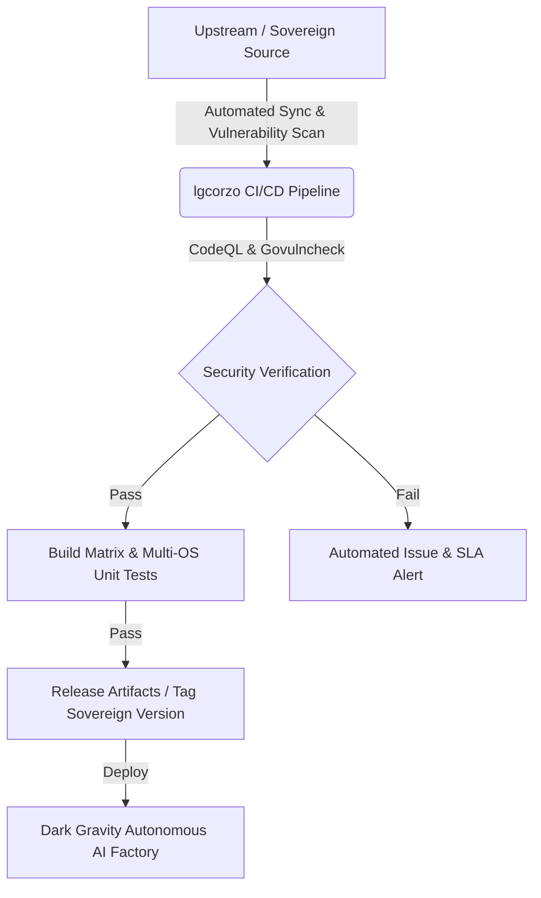

# Gorilla WebSocket (`@lgcorzo/websocket`)

[](https://pkg.go.dev/github.com/lgcorzo/websocket)
[](https://github.com/lgcorzo/websocket/actions/workflows/go.yml)
[](https://github.com/lgcorzo/websocket/actions/workflows/vulncheck.yml)

Gorilla WebSocket is a high-performance [Go](https://go.dev/) implementation of the [WebSocket](https://www.rfc-editor.org/rfc/rfc6455.txt) protocol.

---

## 🌌 Dark Gravity Factory & Sovereign Support

### Rationale & Mission
As part of the **Sovereign MinIO Ecosystem** (38 interconnected repositories maintained under `@lgcorzo`), this repository (`lgcorzo/websocket`) serves as the core low-latency duplex networking engine powering real-time streaming, console management, and asynchronous event notifications across the **Dark Gravity** autonomous AI factory and sovereign production infrastructure.

- **Full Supply-Chain Autonomy:** Zero reliance on upstream breaking license changes, external ownership shifts, or unannounced deprecations.
- **Dark Gravity Factory Core Integration:** Essential networking layer powering duplex communication for autonomous AI agents, high-throughput storage management, cryptographic key operations, and real-time event pipelines.
- **Compliance & Security:** Actively maintained under strict sovereign SLAs ensuring zero-CVE vulnerabilities and compliance with the EU AI Act, SOC 2 Type II, and ISO 25059 standards.
- **Ecosystem Interoperability:** Native integration across all 38 repositories in the `@lgcorzo` sovereign stack (MinIO Server, MC, KES, Operator, DirectPV, Management Console, SIMD libraries, etc.).

---

## 🏛️ Sovereign MinIO Ecosystem (38 Repositories)

| Category | Repository | Description | Sovereign Status |
| :--- | :--- | :--- | :--- |
| **Core Storage** | `lgcorzo/minio` | High-performance object storage server | Active |
| **Client & Admin Tools** | `lgcorzo/mc` | MinIO Client command-line interface | Active |
| **Security & KMS** | `lgcorzo/kes` | Key Encryption Service for MinIO | Active |
| | `lgcorzo/kms-go` | Go KMS SDK for MinIO / KES | Active |
| | `lgcorzo/sftp` | SFTP subsystem for MinIO | Active |
| **Kubernetes & Cloud** | `lgcorzo/operator` | MinIO Operator for Kubernetes | Active |
| | `lgcorzo/directpv` | Direct-attached storage CSI driver | Active |
| **Networking & Routing** | `lgcorzo/websocket` | High-performance WebSocket engine for Go | Active (This Repo) |
| | `lgcorzo/pkg` | Core utility package for MinIO services | Active |
| | `lgcorzo/zip` | Streaming ZIP archive implementation | Active |
| **Console & Web UI** | `lgcorzo/console` | MinIO Management Console UI | Active |
| **Acceleration & SIMD** | `lgcorzo/sha256-simd` | SIMD-accelerated SHA256 in Go | Active |
| | `lgcorzo/md5-simd` | SIMD-accelerated MD5 implementation | Active |
| | `lgcorzo/blake2b-simd` | SIMD-accelerated BLAKE2b implementation | Active |
| | `lgcorzo/highwayhash` | SIMD-accelerated HighwayHash | Active |
| | `lgcorzo/simdjson-go` | High-performance SIMD JSON parser | Active |
| | `lgcorzo/sio-go` | Encrypted data streaming in Go | Active |
| | `lgcorzo/dsa` | Data Structure Algorithms library | Active |
| **SDKs & Libraries** | `lgcorzo/minio-go` | MinIO Go Client SDK | Active |
| | `lgcorzo/madmin-go` | MinIO Admin Go Client SDK | Active |
| | `lgcorzo/minio-java` | MinIO Java Client SDK | Active |
| | `lgcorzo/minio-py` | MinIO Python Client SDK | Active |
| | `lgcorzo/minio-js` | MinIO JavaScript Client SDK | Active |
| | `lgcorzo/minio-dotnet` | MinIO .NET Client SDK | Active |
| | `lgcorzo/minio-cpp` | MinIO C++ Client SDK | Active |
| | `lgcorzo/minio-hs` | MinIO Haskell Client SDK | Active |
| **Ecosystem & Support** | `lgcorzo/sidekick` | High-performance load balancer for MinIO | Active |
| | `lgcorzo/warp` | MinIO performance benchmarking tool | Active |
| | `lgcorzo/dsuite` | MinIO diagnostic suite | Active |
| | `lgcorzo/healthcheck` | Health check service for MinIO | Active |
| | `lgcorzo/certgen` | MinIO TLS certificate generator | Active |
| | `lgcorzo/mint` | MinIO integration test suite | Active |
| | `lgcorzo/event-notification` | Event notification pipeline | Active |
| | `lgcorzo/object-lock` | Object locking and retention module | Active |
| | `lgcorzo/lifecycle` | Data lifecycle management module | Active |
| | `lgcorzo/tiering` | Tiering and cold storage connector | Active |
| | `lgcorzo/identity-provider` | Identity provider integration | Active |
| | `lgcorzo/audit-logger` | Audit logging subsystem | Active |

---

## 🔄 Maintenance Plan & CI/CD Pipeline



---

## 📖 Documentation & Examples

- [API Reference](https://pkg.go.dev/github.com/lgcorzo/websocket)
- [Chat Example](https://github.com/lgcorzo/websocket/tree/master/examples/chat)
- [Command Example](https://github.com/lgcorzo/websocket/tree/master/examples/command)
- [Echo Client and Server Example](https://github.com/lgcorzo/websocket/tree/master/examples/echo)
- [File Watch Example](https://github.com/lgcorzo/websocket/tree/master/examples/filewatch)

---

## 📦 Installation

```bash
go get github.com/lgcorzo/websocket
```

---

## 🧪 Protocol Compliance

The Gorilla WebSocket package passes the server tests in the [Autobahn Test Suite](https://github.com/crossbario/autobahn-testsuite) using the test harness in the [examples/autobahn](https://github.com/lgcorzo/websocket/tree/master/examples/autobahn) subdirectory.
